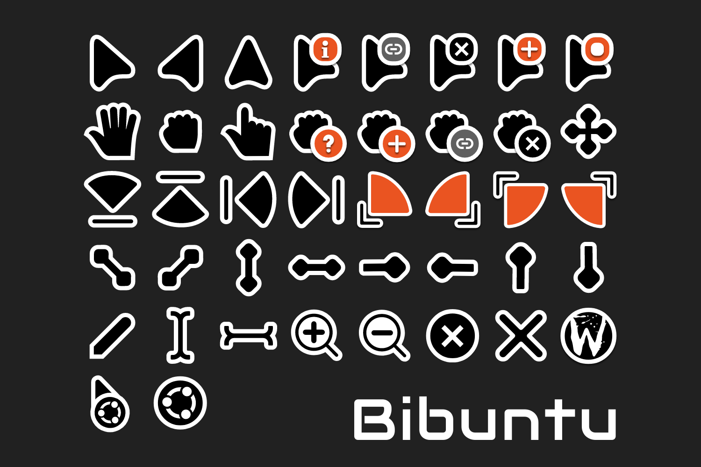

# Bibuntu
A cursor theme for Ubuntu based on Bibata.

Portable **XCursor** theme (Wayland + X11). Hotspots and aliases match **Bibata Modern**.

Based on [Bibata Cursor](https://github.com/ful1e5/Bibata_Cursor) by [Abdulkaiz Khatri](https://github.com/ful1e5).


## Build & install

```bash
python3 build_theme.py
```

Requires: Python 3, Pillow, PyGObject + librsvg (`gi.repository.Rsvg`), cairo.

Installs to:

```
~/.local/share/icons/Bibuntu
```

Apply (GNOME / Ubuntu):

```bash
gsettings set org.gnome.desktop.interface cursor-theme 'Bibuntu'
gsettings set org.gnome.desktop.interface cursor-size 24
```

Or **Settings → Appearance → Cursor**.

Build without installing:

```bash
python3 build_theme.py --no-install
```


## Uninstall

```bash
rm -rf ~/.local/share/icons/Bibuntu
gsettings set org.gnome.desktop.interface cursor-theme 'Bibata-Modern-Classic'
```

## Credits

- **Bibata Cursor** — [ful1e5/Bibata_Cursor](https://github.com/ful1e5/Bibata_Cursor) (GPL-3.0)
- **Bibuntu** — Ubuntu-oriented variant and animation work
